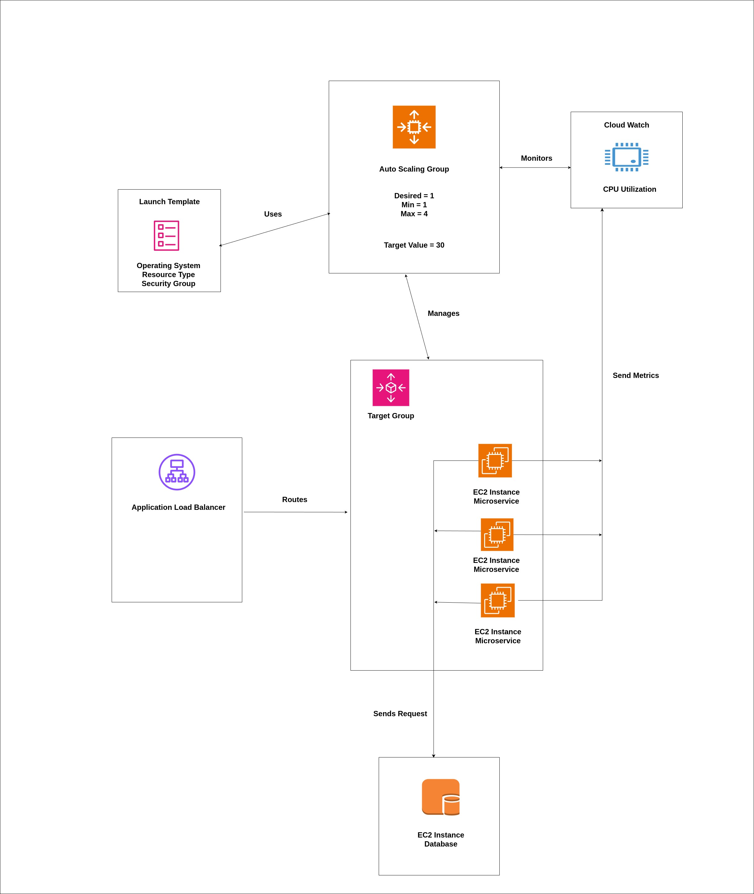

# auto-scaling-and-load-balancing

This project is to demonstrate auto scaling and load balancing in EC2 using a Java microservice.

### How it Works

Requests come into the application load balancer and are routed or distributed to healthy instances in the target group. The auto scaling group is a separate entity and it manages the starting up and terminating of instances. Each instance will send some numerical metrics to cloud watch. In the auto scaling group we set a target tracking policy that monitors the average CPU utilization. If the avg. CPU untilization goes above this target, the auto scaling group will start another instance and if it goes below, it will terminate an instance.

### AWS Setup

Please see the `auto-scaling-and-load-balancing/report.pdf` for more detailed instrcutions on AWS setup.

### MySQL

Use the `couponservice/sql/tables.sql` file to setup the DB.
You will need to change the database url, user and password in the `applications.yml` file.

### couponservice

The couponservice is a Spring Boot microserivce example for creating and reading coupons. It saves and reads data to/from a MySQL database.

A coupon looks like this:

```json
{
  "id": 12345,
  "code": "DUMMYDATA",
  "discount": 10.99,
  "expDate": "01/05/1997"
}
```

### Generating Load

Use the `auto-scaling-and-load-baalancing/send_requests.py` script to generate load on the microservice. You will need to change the application load balancer DNS name.

### Architecture

Here is a basic architecture diagram used to describe the different entities and interactions in this setup for auto scaling and load balancing.


